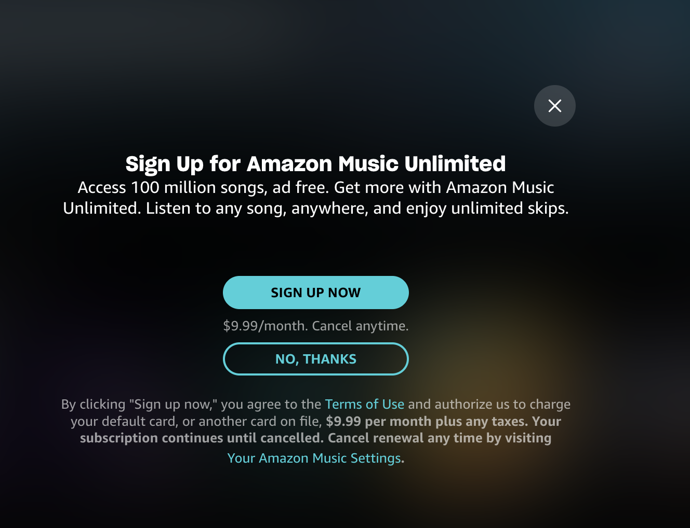

# Browser extension for blocking the upgrade prompt on Amazon Music

On every third load, the music.amazon.com webapp shows
a modal for upgrading with one click to the "Unlimited Plan". 

## How it blocks it?
Currently, the API `https://na.mesk.skill.music.a2z.com/api/showDynamicMessage`
tells the frontend how to render that overlay, 
so this extension blocks that request.